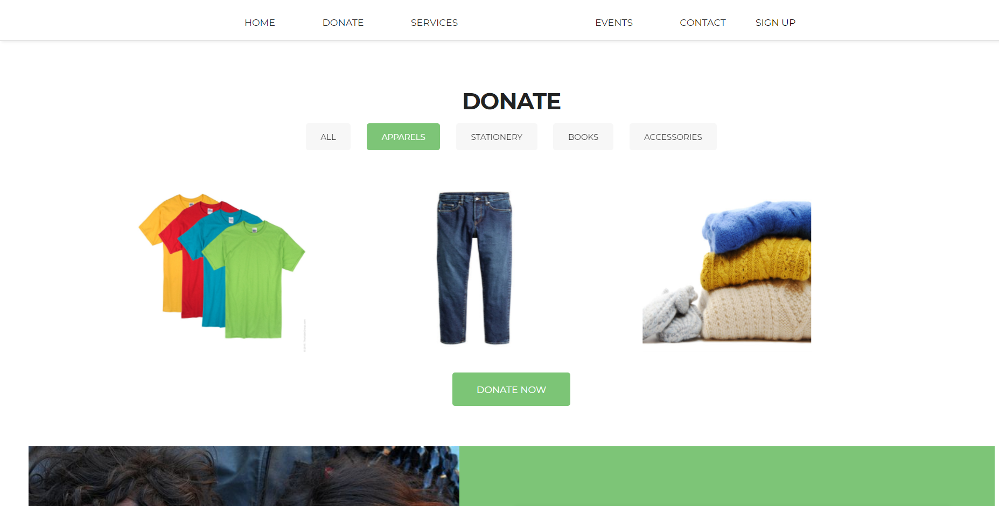
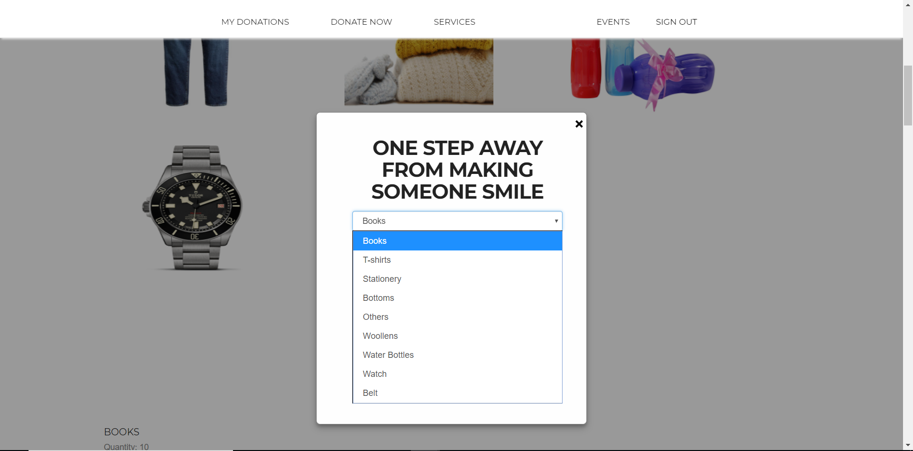

# donateForGood

This mini project was made as a part of the course requirements for Semester 5, Web Technology as prescribed by Mumbai University.

Donate for Good is a donation portal, where you can donate old things at one click, sitting at home and an NGO agency will come to pick up the items and donate it to an orphanage/old age house. In this project, we have done only the Donation module, the NGO module was outside the scope of the project. 
The main features in this project are:

It gives you an option to donate items from different categories like clothing, books, stationery etc.

You have to sign in to donate. You can either create a new account or sign in. 

After signing in, your profile page opens. In order to donate, you enter the type of item (taken from database, as we assume that the NGOs can change them at any point of time), quantity, description and a pick up address. 

You get to see a list of all the items which you have donated till date.

